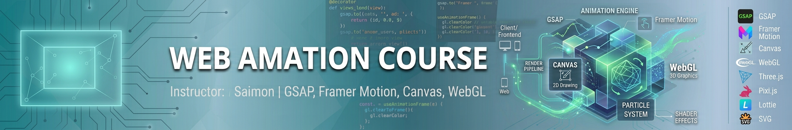

<p align="center">
  
</p>


# GSAP সম্পূর্ণ গাইড 


# PART 1 — GSAP Basics

## GSAP কী?
**GSAP (GreenSock Animation Platform)** হলো একটি জাভাস্ক্রিপ্ট লাইব্রেরি, যেটা দিয়ে ওয়েবপেজের যেকোনো এলিমেন্ট (div, text, image, SVG ইত্যাদি) কে খুব স্মুথ এবং হাই-পারফরম্যান্স অ্যানিমেশন করানো যায়। CSS animation বা transition-এর চেয়ে এটা অনেক বেশি শক্তিশালী এবং সব ব্রাউজারে সমানভাবে কাজ করে।

ব্যবহার করার আগে GSAP লাইব্রেরি লোড করতে হয়:
```html
<script src="https://cdnjs.cloudflare.com/ajax/libs/gsap/3.12.5/gsap.min.js"></script>
```

---

## gsap.to()
এটা সবচেয়ে বেশি ব্যবহৃত মেথড। এলিমেন্টের **বর্তমান অবস্থা থেকে** নতুন (target) অবস্থায় অ্যানিমেট করে।

```js
gsap.to(".box", {
  x: 300,        // ডানে ৩০০px সরবে
  rotation: 360,  // ঘুরবে
  duration: 2,     // ২ সেকেন্ড সময় নেবে
});
```
মানে: `.box` এলিমেন্ট যেখানে আছে সেখান থেকে শুরু করে `x: 300` পর্যন্ত যাবে।

---

## gsap.from()
এটা ঠিক `to()`-এর উল্টো। এলিমেন্ট একটা **নির্দিষ্ট অবস্থা থেকে শুরু** করে তার আসল (বর্তমান/CSS) অবস্থায় ফিরে আসে।

```js
gsap.from(".box", {
  y: -100,     // ওপর থেকে -100px জায়গা থেকে শুরু হবে
  opacity: 0,   // অদৃশ্য অবস্থা থেকে শুরু
  duration: 1,
});
```
মানে: এলিমেন্টটা ওপরে অদৃশ্য অবস্থায় ছিল, সেখান থেকে নিচে নেমে স্বাভাবিক জায়গায় এসে দৃশ্যমান হবে। এটা সাধারণত **entrance animation**-এর জন্য ব্যবহার হয়।

---

## gsap.fromTo()
`from()` এবং `to()` দুটোকে একসাথে কন্ট্রোল করার জন্য — শুরুর অবস্থা এবং শেষের অবস্থা দুটোই নিজে বলে দিতে হয়।

```js
gsap.fromTo(".box",
  { x: -200, opacity: 0 },   // শুরু
  { x: 0, opacity: 1, duration: 1.5 }  // শেষ
);
```
এটা সবচেয়ে বেশি নির্ভরযোগ্য পদ্ধতি, কারণ শুরু ও শেষ দুটোই স্পষ্টভাবে নির্ধারিত থাকে — কোনো অনুমান নির্ভরতা নেই।

---

## duration
অ্যানিমেশন কতক্ষণ ধরে চলবে (সেকেন্ডে) সেটা বলে।
```js
gsap.to(".box", { x: 300, duration: 3 }); // ৩ সেকেন্ড
```

---

## delay
অ্যানিমেশন শুরু হওয়ার আগে কতক্ষণ অপেক্ষা করবে।
```js
gsap.to(".box", { x: 300, duration: 2, delay: 1 }); // ১ সেকেন্ড পর শুরু হবে
```

---

## ease
অ্যানিমেশনের গতির ধরন (speed curve) নিয়ন্ত্রণ করে — শুরুতে জোরে/আস্তে, শেষে জোরে/আস্তে ইত্যাদি।
```js
gsap.to(".box", { x: 300, duration: 2, ease: "power2.out" });
gsap.to(".box", { x: 300, duration: 2, ease: "bounce.out" });
gsap.to(".box", { x: 300, duration: 2, ease: "elastic.out(1, 0.3)" });
```
জনপ্রিয় ease: `power1/2/3/4.in/out/inOut`, `bounce`, `elastic`, `back`, `sine`, `linear`, `none`।

---

## properties
যেসব CSS-সম্পর্কিত বৈশিষ্ট্য অ্যানিমেট করা যায় — যেমন:
```js
gsap.to(".box", {
  x: 200,          // translateX
  y: 100,          // translateY
  scale: 1.5,       // আকার
  rotation: 45,      // ঘূর্ণন (ডিগ্রি)
  opacity: 0.5,       // স্বচ্ছতা
  backgroundColor: "#ff0000",
  borderRadius: "50%",
  width: "300px",
});
```

---

## repeat
অ্যানিমেশন কতবার পুনরাবৃত্তি হবে।
```js
gsap.to(".box", { x: 300, duration: 1, repeat: 3 });   // মোট ৪ বার চলবে (১+৩)
gsap.to(".box", { x: 300, duration: 1, repeat: -1 });  // অসীমবার (infinite loop)
```

---

## yoyo
`repeat`-এর সাথে ব্যবহার হয় — animation শেষ হয়ে আবার উল্টোদিকে ফিরে আসবে কিনা।
```js
gsap.to(".box", {
  x: 300,
  duration: 1,
  repeat: -1,
  yoyo: true,   // যাবে-আসবে (back and forth)
});
```

---

## stagger
একসাথে একাধিক এলিমেন্ট সিলেক্ট করলে, প্রতিটার অ্যানিমেশন শুরুর মধ্যে সামান্য দেরি (delay) তৈরি করে — একটা wave-এর মতো ইফেক্ট আসে।
```js
gsap.to(".item", {
  y: 50,
  opacity: 1,
  duration: 1,
  stagger: 0.2,   // প্রতিটা এলিমেন্ট ০.২ সেকেন্ড পর পর শুরু হবে
});
```

---

## timeline()
একাধিক অ্যানিমেশনকে ধারাবাহিকভাবে (sequence) সাজানোর জন্য ব্যবহার হয়।
```js
let tl = gsap.timeline();

tl.to(".box1", { x: 200, duration: 1 })
  .to(".box2", { y: 100, duration: 1 })
  .to(".box3", { opacity: 0, duration: 1 });
```
প্রতিটা অ্যানিমেশন আগেরটা শেষ হলে তারপর শুরু হবে — একটার পর একটা।

---
---

# PART 2 — GSAP Advanced

## Timeline (বিস্তারিত)
Timeline হলো একগুচ্ছ অ্যানিমেশনের কন্টেইনার, যেটা তাদের ক্রম, সময় এবং সম্পর্ক নিয়ন্ত্রণ করে। পুরো timeline-কে একসাথে play, pause, reverse, restart করা যায়।
```js
let tl = gsap.timeline({ repeat: -1, yoyo: true, paused: true });
tl.to(".a", { x: 100 }).to(".b", { y: 100 });

tl.play();
tl.pause();
tl.reverse();
```

---

## position parameter
Timeline-এ প্রতিটা অ্যানিমেশন কখন শুরু হবে সেটা নিয়ন্ত্রণ করার প্যারামিটার — `.to()` এর তৃতীয় আর্গুমেন্ট হিসেবে দেওয়া হয়।
```js
let tl = gsap.timeline();

tl.to(".box1", { x: 100, duration: 1 })
  .to(".box2", { y: 100, duration: 1 }, "<")       // আগেরটার সাথেই শুরু (একসাথে)
  .to(".box3", { rotation: 90, duration: 1 }, "-=0.5") // আগেরটা শেষ হওয়ার ০.৫ সে. আগেই শুরু (overlap)
  .to(".box4", { scale: 2, duration: 1 }, "+=0.5")    // আগেরটা শেষ হওয়ার ০.৫ সে. পর শুরু (gap)
  .to(".box5", { opacity: 0 }, 2);                      // Timeline-এর ২য় সেকেন্ডে ঠিক শুরু হবে
```

---

## callbacks
অ্যানিমেশনের বিভিন্ন পর্যায়ে (শুরু/শেষ/আপডেট) কাস্টম ফাংশন চালানোর জন্য।
```js
gsap.to(".box", {
  x: 300,
  duration: 2,
  onStart: () => console.log("শুরু হলো"),
  onUpdate: () => console.log("চলছে..."),
  onComplete: () => console.log("শেষ হলো"),
});
```

---

## set()
কোনো animation ছাড়াই সাথে সাথে (instant) কোনো property বসিয়ে দেয়। মূলত initial state ঠিক করতে ব্যবহার হয়।
```js
gsap.set(".box", { opacity: 0, x: -100 }); // সাথে সাথেই এই অবস্থায় চলে যাবে
```

---

## keyframes
একটা মাত্র `gsap.to()` কলের মধ্যে একাধিক ধাপ (multi-step animation) সংজ্ঞায়িত করা যায়।
```js
gsap.to(".box", {
  keyframes: [
    { x: 100, duration: 1 },
    { y: 100, duration: 1 },
    { rotation: 360, duration: 1 },
  ],
});
```

---

## stagger advanced
Stagger-কে অবজেক্ট আকারে দিলে আরও নিয়ন্ত্রণ পাওয়া যায় — যেমন `from`, `grid`, `amount` ইত্যাদি।
```js
gsap.to(".item", {
  y: 50,
  opacity: 1,
  stagger: {
    amount: 1.5,     // সব মিলিয়ে মোট stagger সময়
    from: "center",   // মাঝখান থেকে শুরু হয়ে দুইদিকে ছড়াবে
    grid: [5, 5],      // গ্রিড আকৃতির লেআউটের জন্য
    ease: "power2.inOut",
  },
});
```

---

## context()
GSAP অ্যানিমেশনগুলোকে গ্রুপ করে রাখা এবং সহজে cleanup (revert) করার জন্য ব্যবহার হয় — বিশেষ করে React-এর মতো ফ্রেমওয়ার্কে, যখন কম্পোনেন্ট unmount হয় তখন সব অ্যানিমেশন/ScrollTrigger পরিষ্কার করে ফেলতে হয়।
```js
let ctx = gsap.context(() => {
  gsap.to(".box", { x: 100 });
});

// পরে সব animation cleanup করতে
ctx.revert();
```

---
---

# PART 3 — ScrollTrigger

ব্যবহারের আগে প্লাগইন লোড ও রেজিস্টার করতে হয়:
```html
<script src="https://cdnjs.cloudflare.com/ajax/libs/gsap/3.12.5/ScrollTrigger.min.js"></script>
<script>
  gsap.registerPlugin(ScrollTrigger);
</script>
```

## ScrollTrigger কী?
GSAP-এর একটি প্লাগইন, যেটা দিয়ে **স্ক্রল করার সাথে সাথে** অ্যানিমেশন ট্রিগার/কন্ট্রোল করা যায় — যেমন ইউজার নিচে স্ক্রল করলে কোনো এলিমেন্ট fade-in হবে বা animate হবে।

```js
gsap.to(".box", {
  x: 500,
  scrollTrigger: ".box", // এই এলিমেন্ট viewport-এ আসলে animation শুরু হবে
});
```

---

## trigger
কোন এলিমেন্টের স্ক্রল অবস্থানের ভিত্তিতে অ্যানিমেশন চালু হবে সেটা নির্ধারণ করে।
```js
gsap.to(".box", {
  x: 500,
  scrollTrigger: {
    trigger: ".section1",  // .section1 এলিমেন্ট ট্র্যাক করা হবে
  },
});
```

---

## start
কখন (trigger এলিমেন্টের কোন অংশ, viewport-এর কোন অংশে আসলে) অ্যানিমেশন শুরু হবে।
```js
scrollTrigger: {
  trigger: ".section1",
  start: "top center",  // trigger-এর 'top' যখন viewport-এর 'center'-এ পৌঁছাবে
}
```

---

## end
কোথায় অ্যানিমেশন শেষ হবে (মূলত `scrub` বা `pin`-এর সাথে ব্যবহার হয়)।
```js
scrollTrigger: {
  trigger: ".section1",
  start: "top top",
  end: "bottom top",   // অথবা end: "+=500" (৫০০px পরে শেষ)
}
```

---

## scrub
সাধারণত অ্যানিমেশন সময়ভিত্তিক চলে, কিন্তু `scrub: true` দিলে অ্যানিমেশনের অগ্রগতি সরাসরি **স্ক্রলবারের সাথে বাঁধা** হয়ে যায় — স্ক্রল করলে এগোয়, স্ক্রল উল্টালে পিছায়।
```js
scrollTrigger: {
  trigger: ".section1",
  start: "top top",
  end: "bottom top",
  scrub: true,      // অথবা scrub: 1 (স্মুথনেসের জন্য ১ সেকেন্ড ল্যাগ)
}
```

---

## markers
ডেভেলপমেন্টের সময় start/end পয়েন্টগুলো স্ক্রিনে দেখানোর জন্য (ডিবাগিং টুল)। প্রোডাকশনে বন্ধ রাখতে হয়।
```js
scrollTrigger: {
  trigger: ".section1",
  start: "top center",
  markers: true,   // স্ক্রিনে রঙিন মার্কার লাইন দেখাবে
}
```

---

## toggleActions
স্ক্রল যখন trigger পয়েন্টগুলো পার হয় (enter, leave, enter back, leave back) তখন animation কী করবে সেটা কন্ট্রোল করে।
```js
scrollTrigger: {
  trigger: ".box",
  start: "top center",
  toggleActions: "play pause resume reverse",
  // ক্রম: onEnter, onLeave, onEnterBack, onLeaveBack
}
```
সাধারণ মান: `play`, `pause`, `resume`, `reverse`, `restart`, `reset`, `none`।

---

## pin
স্ক্রল করার সময় এলিমেন্টকে নির্দিষ্ট জায়গায় **আটকে (pin)** রাখে, যতক্ষণ না ScrollTrigger-এর `end` পয়েন্ট পার হয়।
```js
scrollTrigger: {
  trigger: ".section1",
  start: "top top",
  end: "+=1000",
  pin: true,   // section1 স্ক্রিনে আটকে থাকবে, বাকি কন্টেন্ট এর ভেতরে স্ক্রল হবে
}
```

---

## horizontal scroll
Pin + scrub ব্যবহার করে vertical স্ক্রলকে horizontal মুভমেন্টে রূপান্তর করা যায় — জনপ্রিয় "গ্যালারি স্ক্রল" ইফেক্ট।
```js
let sections = gsap.utils.toArray(".panel");

gsap.to(sections, {
  xPercent: -100 * (sections.length - 1),
  ease: "none",
  scrollTrigger: {
    trigger: ".container",
    pin: true,
    scrub: 1,
    end: () => "+=" + document.querySelector(".container").offsetWidth,
  },
});
```

---

## callbacks (ScrollTrigger)
স্ক্রল trigger পয়েন্ট পার হওয়ার সময় কাস্টম ফাংশন চালানো।
```js
scrollTrigger: {
  trigger: ".box",
  start: "top center",
  onEnter: () => console.log("ঢুকলো"),
  onLeave: () => console.log("বের হলো"),
  onEnterBack: () => console.log("উল্টোদিক থেকে ফিরে ঢুকলো"),
  onLeaveBack: () => console.log("উল্টোদিক থেকে বের হলো"),
  onUpdate: (self) => console.log("progress:", self.progress),
}
```

---
---

# PART 4 — SplitText

ব্যবহারের আগে প্লাগইন রেজিস্টার করতে হয় (SplitText একটি Club GreenSock/প্রিমিয়াম প্লাগইন, GSAP 3.12+ এ ফ্রি হয়েছে):
```html
<script src="https://cdnjs.cloudflare.com/ajax/libs/gsap/3.12.5/SplitText.min.js"></script>
<script>
  gsap.registerPlugin(SplitText);
</script>
```

## SplitText কী?
একটি প্লাগইন, যেটা কোনো টেক্সট এলিমেন্টকে ভেঙে আলাদা আলাদা **অক্ষর (chars)**, **শব্দ (words)** বা **লাইনে (lines)** ভাগ করে দেয় — যাতে প্রতিটা অংশকে আলাদাভাবে অ্যানিমেট করা যায়।

```js
let split = new SplitText(".text", { type: "chars, words, lines" });
```

---

## chars
টেক্সটকে প্রতিটা অক্ষরে ভেঙে ফেলে, প্রতিটা অক্ষর একটা আলাদা `<div>`/`<span>`-এ মোড়ানো থাকে।
```js
let split = new SplitText(".text", { type: "chars" });
// split.chars => সব অক্ষরের array
```

---

## words
টেক্সটকে প্রতিটা শব্দে ভাগ করে।
```js
let split = new SplitText(".text", { type: "words" });
// split.words => সব শব্দের array
```

---

## lines
টেক্সটকে প্রতিটা লাইনে ভাগ করে (multi-line paragraph-এর জন্য কাজে লাগে)।
```js
let split = new SplitText(".text", { type: "lines" });
// split.lines => সব লাইনের array
```

---

## char animation
প্রতিটা অক্ষর একে একে অ্যানিমেট করা (typewriter/reveal ইফেক্টের জন্য জনপ্রিয়)।
```js
let split = new SplitText(".text", { type: "chars" });

gsap.from(split.chars, {
  opacity: 0,
  y: 50,
  duration: 0.6,
  stagger: 0.03,
});
```

---

## word animation
প্রতিটা শব্দ একে একে অ্যানিমেট করা।
```js
let split = new SplitText(".text", { type: "words" });

gsap.from(split.words, {
  opacity: 0,
  x: -30,
  duration: 0.8,
  stagger: 0.1,
});
```

---

## line animation
প্রতিটা লাইন একে একে অ্যানিমেট করা (headline/paragraph reveal-এর জন্য ভালো)।
```js
let split = new SplitText(".text", { type: "lines" });

gsap.from(split.lines, {
  opacity: 0,
  y: 40,
  duration: 1,
  stagger: 0.2,
});
```

---

## SplitText + ScrollTrigger
স্ক্রল করলে টেক্সট ধীরে ধীরে অক্ষর/শব্দ/লাইন অনুযায়ী প্রকাশ (reveal) হওয়া — জনপ্রিয় একটি মডার্ন ওয়েবসাইট ইফেক্ট।
```js
let split = new SplitText(".heading", { type: "chars" });

gsap.from(split.chars, {
  opacity: 0,
  y: 60,
  stagger: 0.02,
  duration: 0.6,
  scrollTrigger: {
    trigger: ".heading",
    start: "top 80%",
    toggleActions: "play none none reverse",
  },
});
```

---

# সংক্ষেপে মনে রাখার নিয়ম
- **`to`** → বর্তমান থেকে টার্গেটে যায়
- **`from`** → টার্গেট থেকে বর্তমানে ফিরে আসে
- **`fromTo`** → শুরু ও শেষ দুটোই নিজে বলে দিতে হয়
- **`timeline`** → একাধিক animation-কে সাজিয়ে চালানো
- **`ScrollTrigger`** → স্ক্রলের সাথে animation যুক্ত করা
- **`SplitText`** → টেক্সট ভেঙে অক্ষর/শব্দ/লাইন ধরে ধরে animate করা

---

# author 
 Emam Saimon <br>
 <b> Full stack web developer </b>
